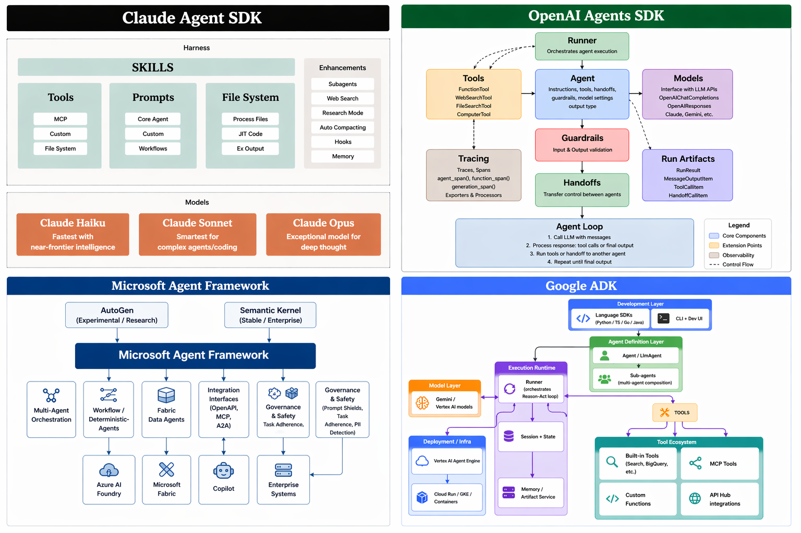
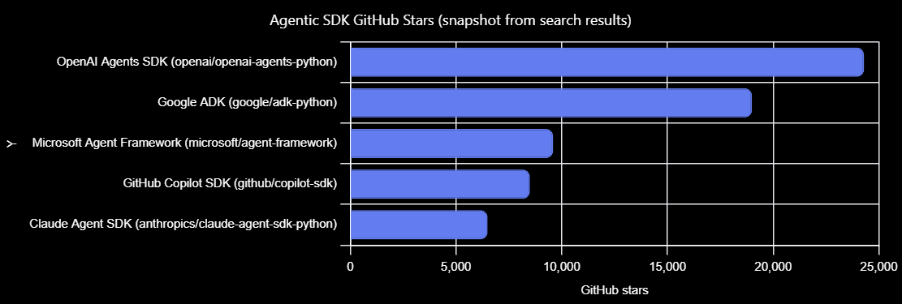
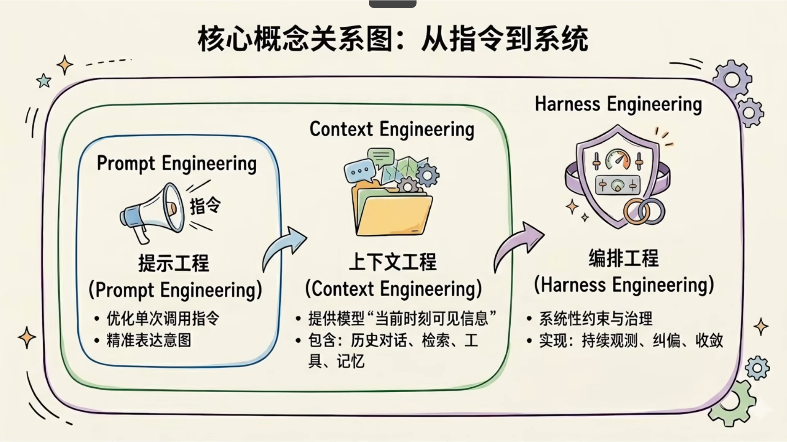
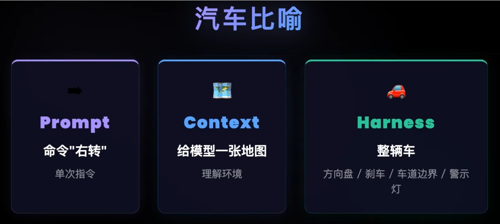

# Agentic SDK Comparison (April 2026)



Many agentic SDKs are emerging in 2026. While most handle the fundamentals well: defining agents, connecting tools, running tool‑calling conversations, streaming responses, producing structured outputs, and supporting async execution. They begin to diverge significantly beyond the quick‑start experience. These differences can have a real impact in practice, which is why I put together a comparison of the most widely used frameworks.

- Claude Agent SDK
- OpenAI Agents SDK
- Google ADK
- Github Copilot SDK (Public preview)
- Microsoft Agent Framework



## What's Harness Engineering






**Diagram source:** Adapted from [Harness Engineering for Agents (YouTube)](https://www.youtube.com/watch?v=Xq-s_hAjADw)

## Harness Engineering Evaluation of Agent SDKs

**Rating legend:** ★★★★★ complete & out-of-the-box · ★★★★ solid, some configuration · ★★★ usable, gaps · ★★ mostly self-built · ★ missing or non-core

| Feature                              | Claude Agent SDK                                                                                                      | OpenAI Agents SDK                                                                                                                                                                                | Microsoft Agent Framework                                                                                                                                  | Google ADK                                                                                                   | GitHub Copilot SDK                                                                                                                                    |
| ------------------------------------ | --------------------------------------------------------------------------------------------------------------------- | ------------------------------------------------------------------------------------------------------------------------------------------------------------------------------------------------ | ---------------------------------------------------------------------------------------------------------------------------------------------------------- | ------------------------------------------------------------------------------------------------------------ | ----------------------------------------------------------------------------------------------------------------------------------------------------- |
| Primary language support             | Python, TypeScript                                                                                                    | Python, TypeScript                                                                                                                                                                               | Python, .NET                                                                                                                                               | TypeScript, Python, Go, .NET, Java                                                                           | TypeScript, Python, Go, .NET, Java                                                                                                                    |
| Model support                        | ⚠️ Claude‑only models; Bedrock / Vertex AI / Azure AI Foundry are delivery channels, not alternative model vendors | ✅ OpenAI models; Azure OpenAI and any OpenAI‑compatible endpoint (Ollama, vLLM, local servers)                                                                                                 | ✅ Azure OpenAI, OpenAI, Microsoft Foundry, Anthropic direct, Ollama                                                                                       | ✅ Gemini‑optimized; 100+ via LiteLLM; native Claude, Gemma, Vertex AI, Apigee                              | ✅ Copilot‑routed models + BYOK (OpenAI, Azure OpenAI, Azure AI Foundry, Anthropic, Ollama, Microsoft Foundry Local). BYOK uses static API keys only |
| Voice / realtime                     | ❌ Not in Agent SDK                                                                                                   | ✅ VoicePipeline (TTS/STT) + Realtime Agents over WebRTC/WebSocket                                                                                                                               | ❌ Not built‑in (no Realtime API integration as of Apr 2026)                                                                                              | ✅ Native Gemini Live API: bidi audio/video/text, VAD, interruption, audio transcription, session resumption | ❌ Not supported                                                                                                                                      |
| **Context management**         | ★★★★★ Built-in auto-compaction at ~95%; queryable context usage; tuned for long-running developer assistants     | ★★★★ Optional auto-compaction wrapper over any session backend; per-run history limit and merge callbacks; can also delegate to server-managed compaction                                    | ★★★★ Pluggable chat-history providers plus memory / RAG / GraphRAG context providers feeding the prompt                                                | ★★★★ Sessions + State + Memory services with rewind to a prior turn                                      | ★★★★★ Dual-threshold automatic compaction (*soft 80%, hard 95%*) with auto-checkpoints; resume is transparent                                  |
| **Tool system**                | ★★★★ Rich built-in OS toolset, in-process and remote MCP, fine-grained allow-list                                 | ★★★★★ Function tools, hosted tools (search / file / code interpreter / computer / shell / apply-patch), MCP over stdio/SSE/HTTP, tool-input/tool-output guardrails per tool                 | ★★★★★ Function tools, hosted tools, MCP (stdio / streamable HTTP / WebSocket), agent-as-tool, function & approval middleware                          | ★★★★ Function tools, Google-hosted tools, OpenAPI / MCP toolsets, sub-agent as tool                      | ★★★ Built-in CLI toolset, per-session custom-tool registration, native MCP gated by a single permission callback                                   |
| **Multi-agent orchestration**  | ★★★ Flat parallel sub-agents; no explicit workflow engine                                                          | ★★★★ Declarative handoffs (with input filters and nested-handoff history); agent-as-tool; no graph engine                                                                                    | ★★★★★ Graph workflow engine (typed edges, fan-out/fan-in, supersteps), plus sequential / concurrent / manager-coordinated / group-chat / A2A patterns | ★★★★ Sequential / Parallel / Loop workflow agents and sub-agents; graph workflows still in preview       | ★★★ Custom agents with intent-based auto-selection and sub-agent lifecycle events; no graph engine                                                 |
| **State & memory**             | ★★★★ Session-store protocol for external backends; supports fork and resume                                       | ★★★★★ Durable, serializable run state with cross-process resume; broad set of session backends (SQLite, async SQLite, Redis, SQLAlchemy, Dapr, OpenAI Conversations, encrypted, advanced)   | ★★★★★ Workflow checkpointing, persistent agents, user-scoped semantic memory and RAG providers                                                        | ★★★★ Distinct Session / State / Memory services with rewind                                              | ★★★★ Resumable sessions via session ID with auto-checkpoints persisted to disk                                                                    |
| **Evaluation & observability** | ★★ Implicit tool traces in the message stream; no first-party trace dashboard                                       | ★★★★★ Built-in trace dashboard (agent / generation / function / guardrail / handoff spans) and broad ecosystem (AgentOps, Logfire, Langfuse, Phoenix, MLflow, Braintrust, W&B, Datadog, …) | ★★★★★ Built-in OpenTelemetry with GenAI semantic conventions; Azure Monitor / App Insights / Aspire integration                                       | ★★★★ Web Dev UI, Cloud Trace, plus AgentOps / Phoenix / MLflow / W&B Weave                               | ★★★★ Built-in OpenTelemetry with W3C trace-context propagation across SDK and CLI                                                                 |
| **Constraints & recovery**     | ★★★★ Multiple permission modes, tool allow-lists, sandboxing on macOS/Linux                                       | ★★★★★ Input / output / tool guardrails (with parallel or blocking execution), tripwire exceptions, per-tool approval flow with serializable run-state HITL and replay                       | ★★★★★ Middleware pipeline, tool-approval gates, content safety, HITL — recovery via workflow checkpoints                                             | ★★★★ Callbacks, plugins, tool-confirmation HITL, A2A isolation, model-side safety filters                | ★★★★ Unified per-call permission callback, per-agent allow/deny lists, pre/post hooks                                                             |

## Multi-agent Orchestration

### Handoffs (OpenAI Agents SDK)

Handoffs allow an agent to delegate tasks to another agent. This is particularly useful in scenarios where different agents specialize in distinct areas. For example, a customer support app might have agents that each specifically handle tasks like order status, refunds, FAQs, etc.

Source: [https://openai.github.io/openai-agents-python/handoffs/](https://openai.github.io/openai-agents-python/handoffs/)

**Basic usage** (OpenAI Agents SDK)

```py
from agents import Agent, handoff

billing_agent = Agent(name="Billing agent")
refund_agent = Agent(name="Refund agent")

triage_agent = Agent(name="Triage agent", handoffs=[billing_agent, handoff(refund_agent)])
```

**Customizing handoffs via the `handoff()` function** (OpenAI Agents SDK)

```py
from agents import Agent, handoff, RunContextWrapper

def on_handoff(ctx: RunContextWrapper[None]):
    print("Handoff called")

agent = Agent(name="My agent")

handoff_obj = handoff(
    agent=agent,
    on_handoff=on_handoff,
    tool_name_override="custom_handoff_tool",
    tool_description_override="Custom description",
)
```

### A2A (Microsoft Agent Framekwork)

The Agent-to-Agent (A2A) protocol enables standardized communication between agents, allowing agents built with different frameworks and technologies to communicate seamlessly.

Source: [https://learn.microsoft.com/en-us/agent-framework/integrations/a2a?tabs=dotnet-cli%2Cuser-secrets&amp;pivots=programming-language-python](https://learn.microsoft.com/en-us/agent-framework/integrations/a2a?tabs=dotnet-cli%2Cuser-secrets&pivots=programming-language-python)

**Agent discovery through agent cards**

```py
import asyncio
import httpx
from a2a.client import A2ACardResolver
from agent_framework.a2a import A2AAgent

async def main():
    a2a_host = "https://your-a2a-agent.example.com"

    # 1. Discover the remote agent's capabilities
    async with httpx.AsyncClient(timeout=60.0) as http_client:
        resolver = A2ACardResolver(httpx_client=http_client, base_url=a2a_host)
        agent_card = await resolver.get_agent_card()
        print(f"Found agent: {agent_card.name}")

    # 2. Create an A2AAgent and send a message
    async with A2AAgent(
        name=agent_card.name,
        agent_card=agent_card,
        url=a2a_host,
    ) as agent:
        response = await agent.run("What are your capabilities?")
        for message in response.messages:
            print(message.text)

asyncio.run(main())
```

## Tool system

### Agent-as-tools (Microsoft Agent Framework)

Agent-as-tools involves a primary agent that delegates sub tasks to other agents and once the agent completes the sub task, control returns to the primary agent.

Source: [https://github.com/microsoft/agent-framework/blob/main/python/samples/02-agents/providers/openai/client_with_agent_as_tool.py](https://github.com/microsoft/agent-framework/blob/main/python/samples/02-agents/providers/openai/client_with_agent_as_tool.py)

```py
import asyncio
from agent_framework import Agent, FunctionInvocationContext
from agent_framework.openai import OpenAIChatClient
from collections.abc import Awaitable, Callable

async def logging_middleware(
    context: FunctionInvocationContext,
    call_next: Callable[[], Awaitable[None]],
) -> None:
    """Middleware that logs tool invocations to show the delegation flow."""
    print(f"[Calling tool: {context.function.name}]")
    print(f"[Request: {context.arguments}]")
    await call_next()
    print(f"[Response: {context.result}]")

async def main() -> None:
    client = OpenAIChatClient()

    # Create a specialized writer agent
    writer = Agent(
        client=client,
        name="WriterAgent",
        instructions="You are a creative writer. Write short, engaging content.",
    )

    # Convert writer agent to a tool using as_tool()
    writer_tool = writer.as_tool(
        name="creative_writer",
        description="Generate creative content like taglines, slogans, or short copy",
        arg_name="request",
        arg_description="What to write",
    )

    # Create coordinator agent with writer as a tool
    coordinator = Agent(
        client=client,
        name="CoordinatorAgent",
        instructions="You coordinate with specialized agents. Delegate writing tasks to the creative_writer tool.",
        tools=[writer_tool],
        middleware=[logging_middleware],
    )

    query = "Create a tagline for a coffee shop"
    print(f"User: {query}")
    result = await coordinator.run(query)
    print(f"Coordinator: {result}")

asyncio.run(main())
```

**Tool Function Limitations vs Agent-as-Tool Benefits**

| Tool Function Limitations                            | Agent-as-Tool Benefits                             |
| ---------------------------------------------------- | -------------------------------------------------- |
| ❌ No intelligence or reasoning                      | ✅ Full LLM reasoning & intelligent analysis       |
| ❌ Single, fixed behavior                            | ✅ Context-aware, adaptive responses               |
| ❌ Cannot use its own tools                          | ✅ Can invoke its own tools and capabilities       |
| ❌ Cannot make decisions or break down complex tasks | ✅ Autonomous task decomposition & decision-making |
| ❌ No independent state management                   | ✅ Independent state & shared session memory       |

### Hosted tool call (Microsoft Agent Framework)

Unlike Claude Agent SDK, Microsoft Agent Framework supports sandboxed Code Interpreter execution through hosted services only. There is no native local code execution capability. Code execution is delegated to Azure-hosted or OpenAI-hosted Code Interpreter services.

```py
import os
from openai import AzureOpenAI
from azure.identity import DefaultAzureCredential, get_bearer_token_provider

# Use Microsoft Entra ID (Azure AD) for authentication
# Requires: az login, or a managed identity / service principal
token_provider = get_bearer_token_provider(
    DefaultAzureCredential(),
    "https://cognitiveservices.azure.com/.default",
)

client = AzureOpenAI(
    azure_endpoint="https://discovery-eastus2.openai.azure.com",   # e.g. https://<resource>.openai.azure.com
    azure_ad_token_provider=token_provider,
    api_version="2025-04-01-preview",                      # version that supports Responses API + code_interpreter
)

container = client.containers.create(name="test-container", memory_limit="4g")

response = client.responses.create(
    model="gpt-4.1-mini",           # your gpt-4.1 deployment name
    tools=[{
        "type": "code_interpreter",
        "container": container.id
    }],
    tool_choice="required",
    input="use the python tool to calculate what is 4 * 3.82. and then find its square root and then find the square root of that result"
)

print(response.output_text)
```

## State Management & Memory

### Session Store (Claude Agent SDK)

The Claude Agent SDK provides session persistence through a SessionStore protocol that allows you to persist conversation state and resume sessions from external storage backends (Redis, Postgres, S3, etc.).

Source: [https://github.com/anthropics/claude-agent-sdk-python/tree/main/examples/session_stores](https://github.com/anthropics/claude-agent-sdk-python/tree/main/examples/session_stores)

```py
import asyncio
import redis.asyncio as redis
from claude_agent_sdk import ClaudeSDKClient, ClaudeAgentOptions
from redis_session_store import RedisSessionStore  # Reference adapter from examples

async def main():
    # 1. Initialize Redis session store
    redis_client = redis.Redis(
        host="localhost",
        port=6379,
        decode_responses=True
    )
    session_store = RedisSessionStore(client=redis_client)

    # 2. Create agent options with session persistence
    options = ClaudeAgentOptions(
        session_store=session_store,
        session_id="my-project-session-123",  # Optional: explicit session ID
        resume="my-project-session-123",       # Resume from this session ID
        # fork_session=True                    # Uncomment to fork instead of continue
    )

    # 3. Create client and resume conversation
    async with ClaudeSDKClient(options=options) as client:
        # Check current context usage and autocompact status
        usage = await client.get_context_usage()
        print(f"Context used: {usage.context_used_tokens}/{usage.context_budget_tokens}")
        print(f"Autocompact enabled: {usage.is_auto_compact_enabled}")
  
        # Continue the conversation from previous session
        response = await client.query(
            prompt="Continue from where we left off. What was the last task?"
        )
        print(f"Agent response: {response}")

        # Save new state back to Redis (automatic)
        print("Session persisted to Redis")

# Run the example
asyncio.run(main())
```

### Semantic Memory (Microsoft Agent Framework)

Foundry persistent agents specifically refer to agents deployed in Azure AI Foundry that leverage semantic memory capabilities through the `FoundryMemoryProvider`. Unlike generic file or database persistence, this provides:

Source: [https://github.com/microsoft/agent-framework/blob/main/python/samples/02-agents/context_providers/azure_ai_foundry_memory.py](https://github.com/microsoft/agent-framework/blob/main/python/samples/02-agents/context_providers/azure_ai_foundry_memory.py)

```py
async def main() -> None:
    # Azure AI Foundry endpoint from environment
    endpoint = os.environ["FOUNDRY_PROJECT_ENDPOINT"]
  
    async with (
        AzureCliCredential() as credential,
        AIProjectClient(endpoint=endpoint, credential=credential) as project_client,
    ):
        # 1. Create Azure Memory Store with semantic capabilities
        memory_store_name = f"agent_framework_memory_{datetime.now(timezone.utc).strftime('%Y%m%d_%H%M%S')}"
  
        # Configure memory store options
        options = MemoryStoreDefaultOptions(
            chat_summary_enabled=False,      # Optional: summarize chat history
            user_profile_enabled=True,       # Extract user preferences/profile
            user_profile_details="Avoid sensitive data like age, financials, precise location"
        )
  
        memory_store_definition = MemoryStoreDefaultDefinition(
            chat_model=os.environ["FOUNDRY_MODEL"],                    # e.g., gpt-4
            embedding_model=os.environ["AZURE_OPENAI_EMBEDDING_MODEL"],  # e.g., text-embedding-3-small
            options=options,
        )
  
        print(f"Creating Azure Memory Store: {memory_store_name}...")
  
        # Create memory store in Azure
        memory_store = await project_client.beta.memory_stores.create(
            name=memory_store_name,
            description="Semantic memory store for persistent agent",
            definition=memory_store_definition,
        )
  
        print(f"✓ Created Memory Store: {memory_store.name}")
        print(f"  ID: {memory_store.id}\n")
  
        # 2. Create Azure-specific chat client
        client = FoundryChatClient(project_client=project_client)
  
        # 3. Create FoundryMemoryProvider for semantic memory
        memory_provider = FoundryMemoryProvider(
            project_client=project_client,
            memory_store_name=memory_store.name,
            scope="user_123",                    # Scope memories to specific user
            update_delay=0,                      # Immediately store memories (set > 0 in production)
        )
  
        # 4. Create agent with Azure memory persistence
        async with Agent(
            name="AzureFoundryAgent",
            client=client,
            instructions="""You are a helpful assistant. You have access to semantic memories
            from previous conversations. Use these memories to provide personalized responses.""",
            context_providers=[memory_provider, InMemoryHistoryProvider(load_messages=False)],
            default_options={"store": False},
        ) as agent:
  
            session = agent.create_session()
  
            # --- Turn 1: Store user preferences as memories ---
            print("=== Turn 1: Learning User Preferences ===")
            query1 = "I prefer dark roast coffee and I'm allergic to nuts. I live in Seattle."
            print(f"User: {query1}")
            result1 = await agent.run(query1, session=session)
            print(f"Agent: {result1}\n")
  
            # Wait for Azure to process memory embeddings
            print("⏳ Storing semantic memories to Azure Memory Store...")
            await asyncio.sleep(5)
  
            # --- Turn 2: Recall memories in new context ---
            print("=== Turn 2: Using Stored Memories ===")
            query2 = "What coffee and snack would you recommend for me?"
            print(f"User: {query2}")
            result2 = await agent.run(query2, session=session)
            print(f"Agent: {result2}\n")
  
            # --- Turn 3: Verify memory recall ---
            print("=== Turn 3: Confirm Stored Memories ===")
            query3 = "What do you remember about my preferences?"
            print(f"User: {query3}")
            result3 = await agent.run(query3, session=session)
            print(f"Agent: {result3}\n")
  
            # 5. Retrieve and display stored memories from Azure
            print("📋 Stored Memories in Azure:")
            memories = await project_client.beta.memory_stores.search_memories(
                name=memory_store.name,
                scope="user_123"
            )
            for memory in memories.memories:
                print(f"  • {memory.memory_item.content}")
  
            # 6. Cleanup: Delete memory store
            await project_client.beta.memory_stores.delete(memory_store_name)
            print("\n✓ Memory store cleaned up")

if __name__ == "__main__":
    asyncio.run(main())
```

Example output:

```
Creating memory store 'agent_framework_memory_20260223'...
Created memory store: agent_framework_memory_20260223 (memstore_57c1f95bb4040c6d00RVOP71Q8tS23opIc4G4ZE8DuALiBFx44)
Description: Memory store for Agent Framework with FoundryMemoryProvider

==========================================
=== First conversation ===
User: I prefer dark roast coffee and I'm allergic to nuts
Agent: Got it—I’ll remember: you prefer dark roast coffee, and you’re allergic to nuts.

Waiting for memories to be stored...
=== Second conversation ===
User: Can you recommend a coffee and snack for me?
Agent: For coffee: **dark roast drip or Americano** (choose a **dark roast** like French/Italian roast). If you like it smoother, try a **dark-roast cold brew**.

For a snack (nut-free): **Greek yogurt with berries**, or a **cheese stick + whole-grain crackers**. If you want something sweet: **dark chocolate (check “may contain nuts” warnings)**.

=== Third conversation ===
User: What do you remember about my preferences?
Agent: - You’re allergic to nuts.
- You prefer dark roast coffee.

Stored memories from: agent_framework_memory_20260223 (memstore_57c1f95bb4040c6d00RVOP71Q8tS23opIc4G4ZE8DuALiBFx44)
Memory: The user is allergic to nuts.
Memory: The user prefers dark roast coffee.
==========================================
Memory store deleted
```

Key Azure Foundry Features:

1. FoundryMemoryProvider — Semantic memory stored in Azure Memory Stores
2. User Scoped Memories — Memories tied to specific users or sessions
3. Automatic Memory Management:

   - User profiles automatically extracted from conversations
   - Chat summaries for long conversations (optional)
   - Semantic search across memory store
4. Azure Resources Required:

   - Azure OpenAI embedding model for semantic search
   - Azure OpenAI chat model
   - Azure Memory Store service

### Serializable RunState (OpenAI Agents SDK)

 RunState is the durable, serializable representation of a paused agent run. It is the foundation for the human-in-the-loop (HITL) flow: when a tool requires approval, Runner.run pauses and returns interruptions; you convert the result into a RunState, persist it (database, queue, file), and later rehydrate it to resume execution exactly where it left off.

Source: [https://openai.github.io/openai-agents-python/human_in_the_loop/](https://openai.github.io/openai-agents-python/human_in_the_loop/)

```py
import asyncio
import json
from pathlib import Path

from agents import Agent, Runner, RunState, function_tool


async def needs_oakland_approval(_ctx, params, _call_id) -> bool:
    return "Oakland" in params.get("city", "")


@function_tool(needs_approval=needs_oakland_approval)
async def get_temperature(city: str) -> str:
    return f"The temperature in {city} is 20° Celsius"


agent = Agent(
    name="Weather assistant",
    instructions="Answer weather questions with the provided tools.",
    tools=[get_temperature],
)

STATE_PATH = Path(".cache/hitl_state.json")


def prompt_approval(tool_name: str, arguments: str | None) -> bool:
    answer = input(f"Approve {tool_name} with {arguments}? [y/N]: ").strip().lower()
    return answer in {"y", "yes"}


async def main() -> None:
    result = await Runner.run(agent, "What is the temperature in Oakland?")

    while result.interruptions:
        # 1. Convert the paused run into a serializable RunState and persist it.
        state = result.to_state()
        STATE_PATH.parent.mkdir(parents=True, exist_ok=True)
        STATE_PATH.write_text(state.to_string())

        # 2. Reload it later (potentially in a different process/host).
        stored = json.loads(STATE_PATH.read_text())
        state = await RunState.from_json(agent, stored)

        # 3. Resolve every pending approval on the rehydrated state.
        for interruption in result.interruptions:
            approved = await asyncio.get_running_loop().run_in_executor(
                None,
                prompt_approval,
                interruption.name or "unknown_tool",
                interruption.arguments,
            )
            if approved:
                state.approve(interruption, always_approve=False)
            else:
                state.reject(interruption)

        # 4. Resume the run with the original top-level agent + state.
        result = await Runner.run(agent, state)

    print(result.final_output)


if __name__ == "__main__":
    asyncio.run(main())
```

## Constraints / Guardrails

### Permission Mode (Claude Agent SDK)

```
Agent: "I want to delete file 'data.txt'"
User: "Yes" or "No"
→ Action executes or stops
```

### HITL Pattern (Microsoft Agent SDK)

```
Agent: "I want to delete file 'data.txt' to clean up workspace"
User: "No, don't delete. Instead, archive it in the /backup folder"
Agent: "Understood. Revised plan: Archive file instead"
→ Agent re-plans with human guidance
```

## Which One to Choose?

- OpenAI Agents SDK: Choose if you want a lightweight framework with strong voice support and the ability to swap LLMs freely.
- Claude Agent SDK: Choose if your agents need deep OS access (developer assistants) or follow a "give the agent a computer" paradigm.
- Google ADK: Choose if you are building enterprise-grade systems on Google Cloud or need multi-language support (Python/Java/Go). Requires a lot of manual plumbing and security.
- GitHub Copilot SDK: Choose if you want to embed a code-centric agent runtime into your app across many languages (Python/Node/Go/.NET/Java) with GitHub-native auth and BYOK. Still in Public Preview.
- Microsoft Agent Framework: Choose if you need graph-based multi-agent workflows on Azure AI Foundry, work in a .NET or Python enterprise stack, or are migrating from Semantic Kernel / AutoGen.

In addition to the agentic SDKs mentioned above, there are several other leading frameworks that are not covered here but are also worth further exploration:

- AgentScope (by Alibaba)
- Dify
- CrewAI
- LangChain / LangGraph

**Reference:** [Composio - Agent SDKs Comparison](https://composio.dev/content/claude-agents-sdk-vs-openai-agents-sdk-vs-google-adk)
