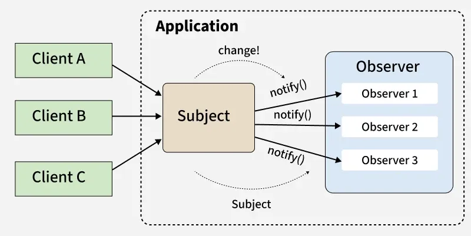

# Observer/Pub-Sub设计模式

- React hooks system (useState listeners)
- Event subscriptions: createSignal() in src/utils/signal.js
- onSessionSwitch.subscribe() in bootstrap/state.ts
- Telemetry event listeners

## Observer/Pub-Sub原型



## Signal使用场景

与存储模式(AppState, createStore)不同，订阅者只需要知道"某件事发生了"，而不需要知道"当前状态值是什么"。

例如

```js
// Example usage:
function handler(source: string): void {
  console.log(`Setting changed: ${source}`)
}

// 注册回调的函数`changed`
const changed = createSignal<[string]>()
// 实际的回调函数`handler`
const unsubscribe = changed.subscribe(handler)
changed.emit('foo')
changed.emit('bar')

// Unsubscribe the handler
unsubscribe()
changed.emit('baz')
```

输出

```
Setting changed: foo
Setting changed: bar
```

## useState使用场景

React Hooks是内置的Observer模型

```js
export function MyComponent() {
  const [count, setCount] = useState(0)
  // ✅ React internally subscribes to 'count'
  // ✅ When setCount() is called, all listeners are notified
  // ✅ Component re-renders (observer pattern)
  
  return <button onClick={() => setCount(count + 1)}>{count}</button>
}
```

## useEffect在CC的使用场景

```js
// src/components/SessionManager.tsx
export function SessionManager() {
  const [sessionId, setSessionId] = useState<SessionId>()
  
  useEffect(() => {
    // 第1步：订阅
    const unsubscribe = onSessionSwitch((newId) => {
      setSessionId(newId)
      logEvent('session_switched', { id: newId })
    })
  
    // 第2步：返回清理函数
    return () => {
      console.log('Unsubscribing from session changes')
      unsubscribe()
    }
  }, [])  // 仅一次
}

// 生命周期：
// 挂载:   onSessionSwitch 订阅器被添加
// 卸载:   unsubscribe() 被调用，订阅取消
```

## Telemetry使用场景

Claude Code的telemetry采用了多层的观察者模式：

```
┌─────────────────────────────────────────────────────────────┐
│  Event Source (调用 logEvent)                               │
└────────────────────┬────────────────────────────────────────┘
                     │ logEvent(eventName, metadata)
                     ▼
┌─────────────────────────────────────────────────────────────┐
│  Analytics Sink (index.ts)                                  │
│  - Event Queue (在 sink 初始化前缓冲事件)                      │
│  - attachAnalyticsSink() 注册观察者                           │
└────────────────────┬────────────────────────────────────────┘
```
