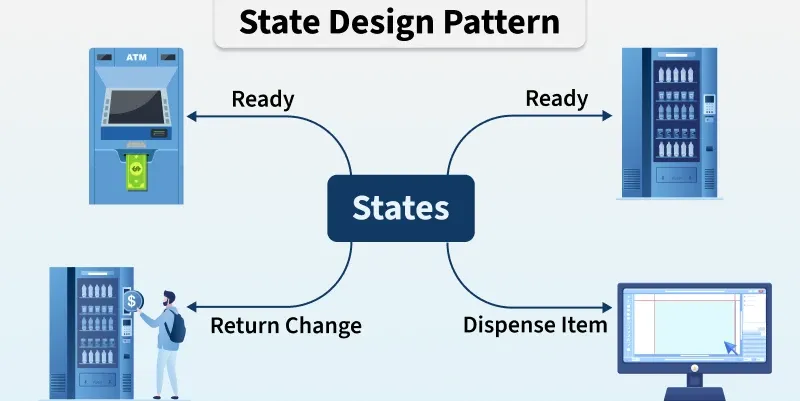
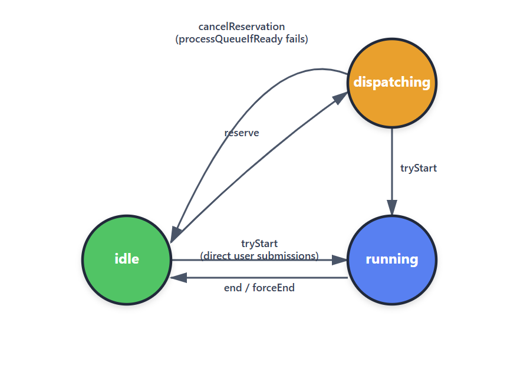

# State设计模式

- Screen states: "prompt" vs "transcript"
- QueryGuard
- [Todo] Tool execution states: pending → streaming → complete
- [Todo] Permission states: ask → allow → deny

## State原型



*Image source: [State Pattern - GeeksforGeeks](https://www.geeksforgeeks.org/system-design/state-design-pattern/)*

## 使用场景：Screen states: "prompt" vs "transcript"

与经典的GoF State 模式不同的是，这里没有 State 接口、 ConcreteState 类、或者委托。它更像是一个**轻量级的两态状态机** ，与[useState使用场景](designPatterns/behavioralPatterns/observer-design-pattern#usestate使用场景)相同：

```js
// src/screens/REPL.tsx
export type Screen = 'prompt' | 'transcript';

const [screen, setScreen] = useState<Screen>('prompt');
```

值得探究的点，当screen `state`从 `prompt`切换到 `transcript`模式时，会触发冻结快照(Frozen Snapshot)。为了避免每次渲染都生成一个新的函数实例，在依赖项[`messages.length`, `streamingToolUses.length`]不变的情况下，`useCallback`会返回缓存的同一函数引用，而非重建实例。需要注意的是，这里的冻结快照只捕获消息数量（长度），并不拷贝消息内容——真正的内容读取发生在渲染时，通过对最新的deferredMessages数组进行 `slice`获取。因此即使消息内容发生变化但长度不变，回调无需重建，冻结机制仍然正确工作。

```js
// Callback to capture frozen state when entering transcript mode
const handleEnterTranscript = useCallback(() => {
setFrozenTranscriptState({
    messagesLength: messages.length,
    streamingToolUsesLength: streamingToolUses.length
});
}, [messages.length, streamingToolUses.length]);
```

## 使用场景: queryGuard.ts

再来看一个稍微复杂一点的情况，`QueryGuard`类定义了一个同步状态机，包含三种状态: `idle, dispatching, running`, 以及对应的转换方法:`reserve, tryStart, for direct user submissions, end/forceEnd, cancleReservation`:



这是一个经典的有限状态机，比 `Screen state`的切换更接近 `State`模式的精神，但没有将每个状态封装为独立的类，仍然不是GoF的经典实现。

当强制中断query的执行，forceEnd()会递增 _generation，使被取消的 query 的 finally 块中调用 end(oldGeneration) 时因 generation 不匹配而返回 false，从而跳过清理逻辑。如果没有 _generation 机制，queryA 被取消后其 finally 块仍会异步执行，调用 end() 把状态设回 idle 并执行清理（重置 spinner、发送 bridge result 等），而此时 queryB 可能已经在运行，导致 queryB 的状态被错误地重置。

```
  queryA 开始 → tryStart() 返回 generation=1
  用户按 Esc → forceEnd() 将 generation 递增到 2
  queryB 开始 → tryStart() 返回 generation=2
  queryA 的 promise reject → finally 调用 end(1)
                             1 !== 2 → 返回 false → 跳过清理 ✓
  queryB 正常完成 → finally 调用 end(2)
                    2 === 2 → 返回 true → 执行清理 ✓
```
